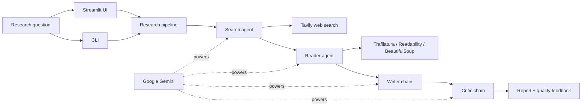

<div align="center">

# Multi-Agent Research Assistant

**A pre-alpha foundation for a planned Gemini-powered workflow that discovers, reads, writes, and reviews evidence from the web.**

[](https://github.com/Axeloooo/Multi-Agent-Research-Assistant/actions/workflows/ci.yaml)
[](https://www.python.org/)
[](https://github.com/psf/black)
[](LICENSE)
[](#project-status)

</div>

> [!IMPORTANT]
> This project is in **pre-alpha development**. The research tools and project
> foundation are being built now; there is not yet a runnable end-to-end
> assistant.

## 📚 Table of contents

- [Overview](#-overview)
- [Project status](#-project-status)
- [Planned workflow](#-planned-workflow)
- [Technology](#-technology)
- [Project structure](#-project-structure)
- [Getting started](#-getting-started)
- [Development](#-development)
- [Roadmap](#-roadmap)
- [Contributing](#-contributing)
- [Code of conduct](#-code-of-conduct)
- [License](#-license)

## 🔎 Overview

Multi-Agent Research Assistant is an early-stage Python project for turning a
research question into a sourced report and a separate quality review. The
planned design assigns each stage to a focused component: finding sources,
extracting readable content, synthesizing a report, and critiquing the result.

The current implementation provides the web-search and content-extraction
tools that will support those agents. Google Gemini is the planned language
model provider, while Tavily supplies web discovery.

## 🚧 Project status

| Area | Status |
| --- | --- |
| Tavily web-search tool | Implemented and unit tested |
| Multi-strategy page extraction | Implemented and unit tested |
| Gemini agent roles | In progress |
| Research pipeline | Planned |
| Command-line interface | Planned |
| Streamlit interface | Planned |

The README documents only commands that work in the current repository.
Planned capabilities are labeled explicitly and should not be treated as a
stable API.

## 🧭 Planned workflow



This diagram represents the target architecture, not the current execution
state.

## 🛠️ Technology

| Technology | Role |
| --- | --- |
| Python 3.14.7 | Application runtime |
| LangChain | Agent and tool composition |
| Google Gemini | Planned agent reasoning and report generation |
| Tavily | Web search |
| Trafilatura | Primary article extraction |
| Readability + Beautiful Soup | Extraction fallbacks |
| Black + Flake8 | Formatting and linting |
| pytest + pytest-cov | Automated tests and coverage |

## 🗂️ Project structure

```text
.
├── .github/workflows/       # Continuous integration and releases
├── src/
│   ├── agents/              # Agent builders (in progress)
│   ├── pipelines/           # Planned workflow orchestration
│   └── tools/               # Search and content-extraction tools
├── tests/                   # Offline unit and structure tests
├── .env.example             # Required environment variable names
├── .flake8                  # Flake8 configuration
├── AGENTS.md                # Codex project instructions
├── CODE_OF_CONDUCT.md       # Community standards
├── CONTRIBUTING.md          # Contributor workflow
├── main.py                  # Planned CLI entry point
├── pyproject.toml           # Black, pytest, and coverage settings
├── requirements.txt         # Runtime dependencies
└── requirements-dev.txt     # Runtime and development dependencies
```

## 🚀 Getting started

### Prerequisites

- [Git](https://git-scm.com/)
- [pyenv](https://github.com/pyenv/pyenv)
- Gemini and Tavily API keys for future live agent execution

### Set up the repository

```zsh
git clone https://github.com/Axeloooo/Multi-Agent-Research-Assistant.git
cd Multi-Agent-Research-Assistant

pyenv install
python -m venv .venv
source .venv/bin/activate

python -m pip install --upgrade pip
python -m pip install -r requirements-dev.txt
cp .env.example .env
```

Add your local credentials to `.env`:

```dotenv
GEMINI_API_KEY=your_gemini_api_key
TAVILY_API_KEY=your_tavily_api_key
```

Never commit `.env` or real credentials. The default test suite uses mocks and
does not require either key.

## 🧪 Development

Run the same quality checks used by CI:

```zsh
black --check .
flake8 .
pytest
```

Apply Black formatting with:

```zsh
black .
```

The test suite enforces at least 80% line coverage across `src`.

## 🗺️ Roadmap

- [x] Establish the Python package and development workflow
- [x] Add tested web-search and multi-strategy extraction tools
- [x] Add contributor documentation and automated quality checks
- [ ] Configure Gemini-backed Search, Reader, Writer, and Critic roles
- [ ] Orchestrate the end-to-end research pipeline
- [ ] Add a command-line experience
- [ ] Add a Streamlit interface
- [ ] Add citation validation, observability, and evaluation datasets

## 🤝 Contributing

Contributions are welcome while the project takes shape. Read
[CONTRIBUTING.md](CONTRIBUTING.md) before opening a pull request. Contributor
changes target the `devel` branch and use Conventional Commit messages.

## 🫶 Code of conduct

Participation in this project is governed by the
[Code of Conduct](CODE_OF_CONDUCT.md).

## 📄 License

This project is available under the [MIT License](LICENSE).
