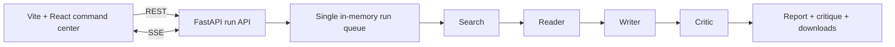

<div align="center">

# Multi-Agent Research Assistant

**A Beta, local-first research command center that streams a Search → Reader → Writer → Critic workflow to a polished web UI.**

[](https://github.com/Axeloooo/Multi-Agent-Research-Assistant/actions/workflows/ci.yaml)
[](https://www.python.org/)
[](https://nodejs.org/)
[](#project-status)

</div>

> [!IMPORTANT]
> This is a Beta local application. Its command center, typed streaming runtime,
> safe live agent-activity feed, and offline test harness are implemented. Live
> research requires valid Gemini and Tavily credentials and provider setup.

## Overview

Enter a focused question in the browser and watch four agents advance through a
single research run. The UI shows safe per-agent summaries and fixed, live
activity labels such as “Thinking”, “Using tool”, and “Streaming response”. It
streams the report and critique as they arrive, supports cancellation, and
offers Markdown and JSON downloads once the run completes.

The application is intentionally local and process-scoped: it retains up to 20
completed runs in memory, runs one job at a time, and loses run history when the
server restarts. It is not yet a multi-user service or durable job queue.



## Project status

| Area | Status |
| --- | --- |
| Tavily search and multi-strategy extraction adapters | Implemented and unit tested |
| Gemini Search, Reader, Writer, and Critic construction | Implemented; requires local credentials for live use |
| Typed async research pipeline with bounded stage deadlines | Implemented and unit tested |
| FastAPI run queue, status snapshots, cancellation, and SSE replay | Implemented and unit tested |
| React + Vite + Tailwind command center | Implemented |
| Storybook, Vitest/RTL, and Playwright E2E coverage | Implemented; default tests use no live providers |
| Durable storage, authentication, citations, and evaluations | Planned |

## Architecture and safety

- `backend/src/tools/` contains provider and extraction adapters.
- `backend/src/agents/` constructs agent prompts and chains.
- `backend/src/pipelines/` owns typed stage sequencing and
  provider-neutral events.
- `backend/src/api/` turns safe pipeline events into REST,
  SSE, snapshots, cancellation,
  and downloads.
- `frontend/` is the Vite TypeScript application.
- `backend/tests/{agents,api,pipelines,tools}/` and
  `frontend/tests/{unit,e2e}/` mirror the runtime boundaries.

The browser never receives raw tool calls, provider metadata, chain reasoning,
or raw exceptions. It receives bounded agent summaries, report/critique deltas,
and a fixed allowlist of activity labels. Search and Reader have 45-second
deadlines, Writer has a 90-second deadline, Critic has a 45-second deadline,
and Tavily requests time out after 30 seconds. A failed stage produces a safe
terminal error and skips later stages. Disconnecting a browser does not cancel a
run; use the explicit Cancel research action instead.

## Local setup

Prerequisites: Git, Python 3.14.7 (managed by `pyenv`), Node.js 22.13+ and npm
10+, plus Gemini and Tavily keys only for manually exercising live providers.

```zsh
git clone https://github.com/Axeloooo/Multi-Agent-Research-Assistant.git
cd Multi-Agent-Research-Assistant

cd backend
pyenv install
python -m venv .venv
.venv/bin/python -m pip install --upgrade pip
.venv/bin/python -m pip install -r requirements-dev.txt

cd ../frontend
npm install
cd ../backend

cp .env.example .env
```

Add credentials only to your uncommitted `.env` when manually testing live
providers:

```dotenv
GEMINI_API_KEY=your_gemini_api_key
TAVILY_API_KEY=your_tavily_api_key
```

## Run the command center

For local development, start the API and frontend in separate terminals:

```zsh
# Terminal 1, backend/
.venv/bin/uvicorn src.api.app:create_app --factory --reload --port 8000

# Terminal 2
cd frontend
npm run dev
```

Open the URL Vite prints (normally `http://localhost:5173`). The development
server proxies `/api` requests to FastAPI. For a production-like local preview,
run `npm run build`; FastAPI serves `frontend/dist` when it exists.

## Development and tests

Python quality gates remain Black and Flake8. Frontend source uses ESLint and
Prettier. The Python suite requires at least 80% line coverage across
`backend/src`.

```zsh
# Backend
cd backend
.venv/bin/black --check .
.venv/bin/flake8 .
.venv/bin/pytest

# Frontend
cd frontend
npm run format
npm run lint
npm test
npm run build
npm run build-storybook
```

Playwright runs an actual local FastAPI API with a deterministic, credential-free
pipeline and a Vite browser client. Install Chromium once, then run the suite:

```zsh
cd frontend
npx playwright install chromium
npm run test:e2e
```

The CI workflow runs the backend checks, frontend format/lint/unit/build/
Storybook checks, then the browser test. No default test makes live provider or
network calls.

## Technology

| Technology | Role |
| --- | --- |
| Python + FastAPI + Uvicorn | Run orchestration, REST API, SSE, downloads |
| LangChain + Gemini + Tavily | Live research providers |
| React + Vite + TypeScript + Tailwind | Local command-center UI |
| Storybook | Component development and accessibility addon |
| pytest + pytest-cov | Offline Python tests and coverage |
| Vitest + React Testing Library | Frontend unit tests |
| Playwright | Browser E2E test with a fake pipeline |
| Black + Flake8 + ESLint + Prettier | Formatting and linting |

## Contributing

Read [CONTRIBUTING.md](CONTRIBUTING.md) before opening a pull request. Branches
start from and target `devel`; commits use Conventional Commits so
semantic-release can classify changes. Never commit `.env`, API keys, private
research data, or generated sensitive reports.

## License

This project is available under the [MIT License](LICENSE).
